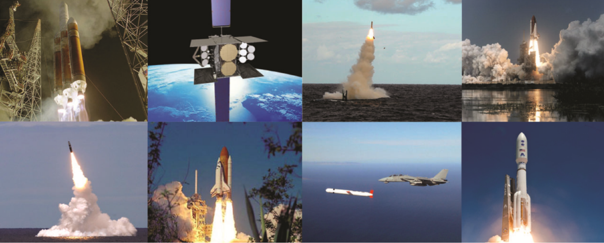

:title: Pyrotechnic Actuator Installation Robot
:org: Sandia National Laboratories
:website: http://www.sandia.gov/
:location: Livermore, CA, USA
:skills: mechanical design, robotics, software

Pyrotechnic actuators are highly reliable, compact single shot devices that are
used by industry to perform rapid mechanical work on components. Due to their
inherent high reliability, actuators are often used where a failure would
result in death or a substantial loss of property.   Pyrotechnic actuators are
initiated by a bridgewire which causes the pyrotechnic to rapidly deflagrate,
thereby generating hot gas capable of performing work in a system.  Pyrotechnic
actuators, such as the PC-23, have many applications including; ejector seats,
emergency oxygen flow on airplanes, fast-shear bolts, cable cutters, airbags,
safe/arm units in missiles, fuel transfer and many others.  The figure below
shows a small cross-section of the devices that use pyrotechnic actuator driven
components.

A bare actuator alone is not very useful; it must be installed into an assembly
designed to function with rapidly expanding hot gas in order to accomplish
work. The handling of bare pyrotechnic actuators during the installation
process is hazardous, mainly due to the potential for stray currents to ignite
the actuator before it is safely installed in the larger assembly. If a bare
actuator ignites while being handled by an operator, serious injury, and in
extreme cases, death can result.

The only known way to install actuators is by hand, a process that can
potentially expose the operator to dangers associated with bare actuators.  Due
to the hazards, the safety procedures for installing actuators into assemblies
can be quite arduous.  In addition, Sandia strives to follow the cardinal rule
of explosives; expose the minimum amount of personnel to the minimum amount of
explosives for the minimum amount of time. If the actuator installation process
was automated, Sandia would better serve the cardinal rule, personnel would be
safer and the labs working with actuators would realize an increase in
efficiency. Sandia uses many different actuators as part of the National
Security Mission, but this problem statement will focus on one: the PC-23.
More information on the PC-23 can be found at
http://www.hstc.com/Products/OrdnanceProducts/PowCartSquibInit/PC23Series/

The task is as follows: Design a robot that locates PC-23 actuators in an open
packing tray (much like a miniature egg carton) and installs them in a larger
assembly. This will occur in a designated “explosives room” where power sources
are very limited to minimize the potential for stray currents.  Key features of
the robot include:

- Minimize electrical power needs – any necessary electrical components must be
  intrinsically safe (explosion proof).   Options to minimize the use of
  electrical components include pneumatics and hydraulics.
- The robot’s energy source must be self-contained and all components shall
  operate with as low voltages as possible.  No connection to building
  electricity is allowed.
- The robot must be able to remove the PC-23 from the egg-crate-like container
  it is shipped in.
- The robot shall be able to install the PC-23 into a threaded hole and torque
  it to a pre-specified, adjustable torque.
- The robot shall not damage the PC-23 in any way, including cosmetic level
  scratches.
- Although complete automation is desired (push a single button to commence
  installation process), it is not necessary.  The robot may be remote
  controlled and guided to the PC-23 in the crate and to the destination part
  by a human.
- Any remote control cannot be RF based and must be wired through shielded
  cables.
- The PC-23 shipping crate will be placed within 18 inches of the part into
  which the actuator must be installed.
- Parts of the robot that come into contact with the PC-23 shall be grounded to
  the building’s explosive system rated ground.  The resistance between these
  parts and the building ground may be no more than 0.5 ohms.
- Initial budget is $3000.
